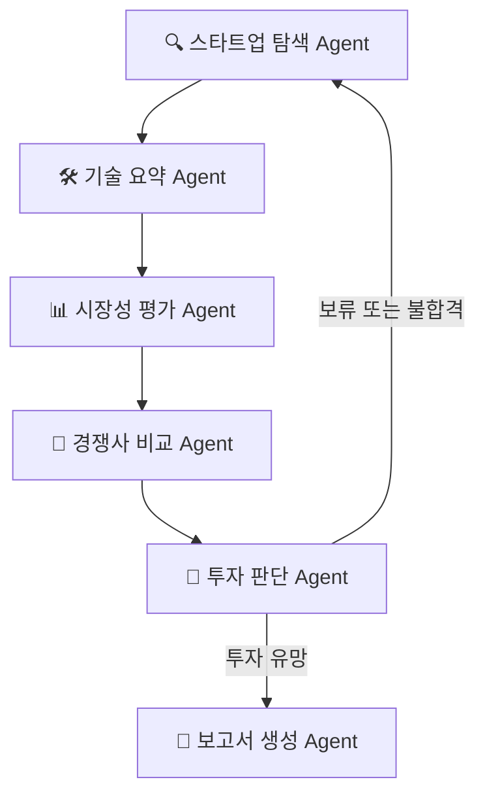

# AI Startup Investment Evaluation Agent

본 프로젝트는 생성형 AI 기반 광고 솔루션 스타트업의 기술력, 시장성, 경쟁력 등을 종합적으로 분석하여 **투자 가능성을 평가**하는 Multi-Agent 기반 시스템입니다. 

특히, 각 Agent는 **LangGraph** 구조에 따라 유기적으로 연결되며, 특정 Agent에는 Naive RAG를 사용해 효과적으로 분석할 수 있도록 설계했습니다.

>  ✨ 양해의 말씀... 본 프로젝트는 웹만 해본 짝궁 둘이 구현하여 퀄리티가 떨어집니다... 너그럽게 봐주세요 🥹 

## 🧩 Overview

### Domain
생성형 AI 기반 **광고 영상 솔루션** 스타트업
### Goal
투자 가능성 판단 및 보고서 자동 생성
### Method
Langraph +Multi-Agent + Naive RAG
### Reference
- 위키백과 스타트업 기준
- [AI in Marketing Report](https://www.grandviewresearch.com/industry-analysis/artificial-intelligence-marketing-market-report)- Scorecard Valuation Method(평가 기준)

## 🧠 Features

- PDF 기반 IR 자료 및 시장 보고서 RAG 요약
- 스타트업 탐색 → 기술 요약 → 시장성 → 경쟁사 → 투자 판단 → 보고서 생성 자동화
- 조건 분기형 워크플로우: 투자 보류/불합격 시 루프 재시도

## ⚙️ Tech Stack

| Category   | Detail                        |
|------------|-------------------------------|
| Framework  | LangGraph, LangChain, Python  |
| VectorDB   | FAISS                         |
| LLM        | GPT-4o-mini (OpenAI API)      |
| External   | Tavily API (웹 검색 Tool)     |


## 🔗 Architecture



## 🧠 Agents Overview

본 프로젝트는 Multi-Agent + Agentic RAG 구조를 통해 AI 스타트업의 기술력, 시장성, 경쟁력 등을 종합적으로 분석하여 투자 판단을 내리는 시스템입니다. 아래는 각 에이전트의 정의와 역할입니다.

---

### 🔍 1. 스타트업 탐색 에이전트
- **역할**: RAG 기반으로 광고 AI 스타트업을 조사하고, 창업자 정보와 함께 후보 기업을 도출
- **입력**: 스타트업 평가 기준 (`question`)
- **데이터 소스**:
  - 📄 Opensurvey Trend Report 2021 (PDF)
  - 🌐 Tavily Web Search (TechCrunch, CB Insights 등)
  - ✅ **RAG 적용**: PDF 및 Web 검색 기반
#### 출력 예시:
```python
{
  "startup_list": [
    {
      "name": "AdBrain AI",
      "founder": "Jane Doe",
      "founder_background": "Google 광고팀 출신",
      "website": "https://adbrain.ai"
    }
  ]
}
```
### 2. 🛠️ 기술 요약 에이전트
- 역할: 각 스타트업의 공식 웹사이트 및 기술 논문을 기반으로 핵심 기술과 제품 강점 요약
- 입력: startup_list에서 받은 기업 정보
- 데이터 소스:
    - 📄 논문: 광고 AI 논문, VC-LLM 등
	- ✅ RAG 적용: 논문 요약 기반
#### 출력 예시
```python
{
  "tech_summary": [
    {
      "name": "AdBrain AI",
      "core_tech": "LLM 기반 개인화 광고 생성",
      "product_strength": "광고 성과 예측 정확도 92%"
    }
  ]
}
```
### 📊 3. 시장성 평가 에이전트
- 역할: 각 스타트업의 핵심 기술이 마케팅 시장 내에서 경쟁력이 있는지 평가
- 입력: 기술 요약 정보 (tech_summary)
- 데이터 소스:
	- 📄 시장 보고서: Generative AI Video Creation Market Landscape
	- ✅ RAG 적용: 시장 보고서 

#### 출력 예시
```python
{
  "market_eval": [
    {
      "name": "AdBrain AI",
      "market_score": 80,
      "reason": "광고 AI 시장은 연평균 13% 성장"
    }
  ]
}
```
### 🥹. 경쟁사 비교 에이전트
경쟁사 비교는 생략했습니다.

시장성 평가에서 산업 내 기술 동향 및 유사 기술과의 간접 비교가 포함되었기 때문에 중복 분석을 피하고 효율성을 높이기 위해 해당 단계를 제외했습니다. 

### 🧮 4. 투자 판단 에이전트
- 역할: Scorecard Method 기반으로 각 스타트업에 대한 최종 투자 점수 및 평가 도출
- 입력: tech_summary, market_eval, (선택: 경쟁사 정보 등)
- 데이터 소스: 자체 점수화 기준 (Scorecard Method)
- ✅ RAG 적용: **`Scorecard Method`** 

- 엔젤 투자자들이 실전에서 많이 활용하는 스타트업 투자 평가
- Score Table
    
    
    | 항목 | 비중(%) | 평가 포인트 |
    | --- | --- | --- |
    | 창업자 (Owner) | 30% | 전문성, 커뮤니케이션, 실행력 |
    | 시장성 (Opportunity Size) | 25% | 시장 크기, 성장 가능성  |
    | 제품/기술력 | 15% | 독창성, 구현 가능성 |
    | 경쟁 우위 | 10% | 진입장벽, 특허, 네트워크 효과 |
    | 실적 | 10% | 매출, 계약, 유저수 등 |
    | 투자조건 (Deal Terms) | 10% | Valuation, 지분율 등  |
- Reference
    - [Scorecard Valuation Method 설명](https://eqvista.com/scorecard-valuation-method-explained/)
    - [Bill Payne이 개발한 Scorecard Valuation Methodology](https://angelcapitalassociation.org/blog/blog-scorecard-valuation-methodology-rev-2019-establishing-the-valuation-of-pre-revenue-start-up-companies/)

#### 출력 예시
```python
{
  "investment_score": {
    "name": "AdBrain AI",
    "owner": 8.5,
    "market": 9.0,
    "tech": 7.5,
    "advantage": 6.0,
    "traction": 7.0,
    "deal_terms": 5.5,
    "total_score": 76.5,
    "decision": "투자 유망"
  }
}
```

### 📝 5. 보고서 생성 에이전트
- 역할: 전체 에이전트 결과값을 종합하여 투자 보고서 자동 생성
- 입력: 위 모든 에이전트의 출력값
- 출력: 보고서 텍스트 (기업 개요, 분석 결과, 투자 평가 등)
- ❌ RAG 미적용 (내부 정보만 사용)
#### 출력 예시
```
1. 개요
2. 스타트업 분석
3. 관련 기업 요약
4. 기업별 투자 평가
    1. 기업명
    2. 분석
    3. 투자 평가 결과 (결과 점수, 합격/보류/불합)
    4. 결과 도출 이유
```


## 👩‍💻 Contributors

| 이름 | 역할 |
|------|------|
| <a href="https://github.com/chaerish"></a><br>**김채연(죄인)** | 🧠 Prompt Engineering<br>🔧 Agent Design |
| <a href="https://github.com/EunJung516"></a><br>**조은정** | 📄 PDF Parsing<br>🔍 Retrieval Agent<br>✍️ Prompt Engineering |
