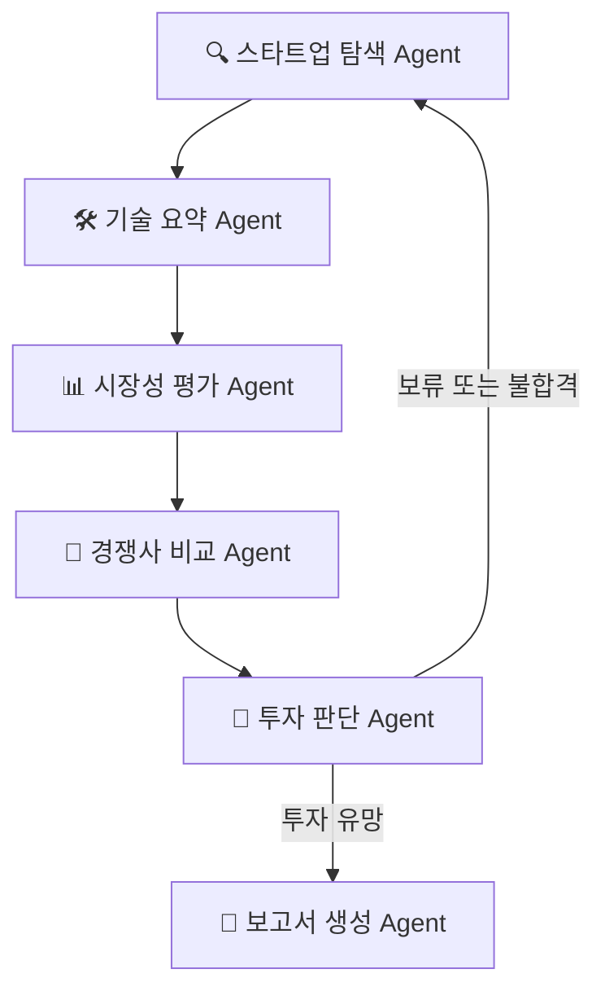

# AI Startup Investment Evaluation Agent

본 프로젝트는 생성형 AI 기반 광고 솔루션 스타트업의 기술력, 시장성, 경쟁력 등을 종합적으로 분석하여 **투자 가능성을 평가**하는 Multi-Agent 기반 시스템입니다. 

특히, 각 Agent는 **LangGraph** 구조에 따라 유기적으로 연결되며, 특정 Agent에는 Naive RAG를 사용해 효과적으로 분석할 수 있도록 설계했습니다.

> ✨ 양해의 말씀... 본 프로젝트는 웹만 해본 짝궁 둘이 구현하여 퀄리티가 떨어집니다... 너그럽게 봐주세요 🥹


## 🧩 Overview

### Domain
생성형 AI 기반 **광고 영상 솔루션** 스타트업
#### 선정 이유

유튜브, 틱톡, 인스타 어디를 가도 짧고 임팩트 있는 도파민의 시대...

📌 그래서
- 빠르게 성장 중인 영상 중심 광고 시장,
- 생성형 AI의 적용성과 파급력,
- 기술력과 시장성이 모두 필요한 고도화된 도메인이라는 점에서

👉 “생성형 AI 기반 광고 영상 스타트업” 을 본 프로젝트의 중심 도메인으로 선정

### Goal
투자 가능성 판단 및 보고서 자동 생성
### Method
Langraph + Multi-Agent + Naive RAG
### Reference
- 위키백과 스타트업 기준
- [AI in Marketing Report](https://www.grandviewresearch.com/industry-analysis/artificial-intelligence-marketing-market-report)- Scorecard Valuation Method(평가 기준)

## 🧠 Features

- PDF 기반 IR 자료 및 시장 보고서 RAG 요약
- 스타트업 탐색 → 기술 요약 → 시장성 → 경쟁사 → 투자 판단 → 보고서 생성 자동화
- 조건 분기형 워크플로우: 투자 보류/불합격 시 루프 재시도

## ⚙️ Tech Stack

| Category   | Detail                        |
|------------|-------------------------------|
| Framework  | LangGraph, LangChain, Python  |
| VectorDB   | FAISS                         |
| LLM        | GPT-4o-mini (OpenAI API)      |
| External   | Tavily API (웹 검색 Tool)     |


## 🔗 Architecture



## 🧠 Agents Overview

본 프로젝트는 Multi-Agent + Agentic RAG 구조를 통해 AI 스타트업의 기술력, 시장성, 경쟁력 등을 종합적으로 분석하여 투자 판단을 내리는 시스템입니다. 아래는 각 에이전트의 정의와 역할입니다.

---

### 🔍 1. 스타트업 탐색 에이전트
- **역할**: RAG 기반으로 광고 AI 스타트업을 조사하고, 창업자 정보와 함께 후보 기업을 도출
- **입력**: 스타트업 평가 기준 (`question`)
#### **RAG 적용**: ✅ 
1. 📄 위키 피디아 startup company 정의 pdf 변환
   - https://en.wikipedia.org/wiki/Startup_company
2.  Riitta Katila, Eric L. Chen, and Henning Piezunka (2012년 6월 7일). "All the right moves: How entrepreneurial firms compete effectively" (PDF) . Strategic Entrepreneurship JNL . 6 (2): 116– 132. doi : 10.1002/sej.1130 . 

- RAG 를 적용해서 나온 평가 기준으로 웹 서치(🌐 Tavily Web Search (TechCrunch, CB Insights 등)) 를 진행했습니다. 
  
#### 출력 예시:

```python
[
  {{
     "name": "회사명",
     "founder": "창업자",
     "founder_background": "창업자 이력",
     "website": "공식 홈페이지"
  }}
]
```
### 2. 🛠️ 기술 요약 에이전트
- 역할: 각 스타트업의 공식 웹사이트 및 기술 논문을 기반으로 핵심 기술과 제품 강점 요약
- 입력: startup_list에서 받은 기업 정보

#### **RAG 적용**: arXiv 논문 ✅ 
1. VC-LLM: 멀티모달 LLM을 활용한 광고 영상 자동 생성
- 출처: arXiv
- 핵심 내용:
  - 멀티 모달(Multimodal)은 텍스트, 이미지, 오디오, 비디오 등 다양한 유형의 데이터를 동시에 처리하고 학습하는 인공지능 기술을 의미해서, ai 생성 광고에 사용되는 주력 기술.
  - arXiv는 GPT-4o 기반의 멀티모달 LLM을 활용하여 고품질의 짧은 광고 영상을 자동으로 생성하는 프레임워크입니다.
  - 고해상도 공간 정보와 저해상도 시간 정보를 결합하여 영상의 세부 사항과 전반적인 흐름을 모두 포착합니다.
  - 훈련 시, 입력 데이터에서 직접 추론할 수 있는 보조 정보를 추가하여 모델의 환각(hallucination)을 줄입니다.
- 활용 포인트:
 - 멀티모달 LLM을 활용한 광고 영상 생성 기술
 - 고해상도 공간 정보와 저해상도 시간 정보의 결합
 - 모델 환각 감소를 위한 보조 정보 활용

#### 출력 예시:


```python
{{
  "name": "{name}",
  "core_tech": "핵심 기술",
  "product_strength": "제품 또는 기술의 강점"
}}
```
### 📊 3. 시장성 평가 에이전트
- 역할: 각 스타트업의 핵심 기술이 마케팅 시장 내에서 경쟁력이 있는지 평가
- 입력: 기술 요약 정보 (tech_summary)
  
#### RAG 적용: ✅ 
**Artificial Intelligence In Marketing Market Size Report, 2030**
- 단순한 LLM 판단이 아닌, 시장 조사 보고서(PDF) 를 기반으로 VectorDB를 구축하고,
- 해당 DB를 통해 질문-응답(RAG) 방식으로 기술의 시장 적합성을 평가
- 출처: Grand View Research
- 핵심 내용:
	- 글로벌 광고 산업에서 AI 기반 광고 제작 솔루션의 시장 규모 및 연평균 성장률(CAGR)

	- 주요 플레이어 (Runway, Synthesia, Pictory, Lumen5 등) 분석

	- 광고 자동화, 콘텐츠 생성, 타겟팅 분야에서 AI 도입 트렌드

	- 활용 포인트: 전체 시장 크기, 주요 기업, 사용 사례 기반 시장성 판단
 
```python
for startup in startup_list:
name = startup.get("name", "")
industry = startup.get("industry", "광고 자동화")  # industry 필드가 없으면 기본값

# 📌 명확한 평가 기준 반영된 프롬프트
question = f"""
'{industry}' 산업군에 속한 스타트업 중, {name}의 시장성을 평가해주세요.

📊 [시장성 평가 항목] (총점 100점)
아래 각 항목에 대해 {name}의 위치를 고려해 점수를 부여하세요:

1. 📈 산업 성장성 (최대 30점)
    - 'AI 광고 제작 솔루션' 시장의 연평균 성장률(CAGR) 기반
    - 시장이 크고 빠르게 성장하면 높은 점수

2. 📊 수요 트렌드 적합성 (최대 20점)
    - 해당 스타트업이 타겟하는 광고/마케팅 영역의 실제 수요 증가율
    - 퍼포먼스 마케팅/리타게팅/UGC영상 등 트렌드 적합성 기반

3. ⚔️ 경쟁 환경과 시장 포지셔닝 (최대 20점)
    - 경쟁사 수, 진입 장벽, 점유율 등
    - 해당 기업의 상대적 위치와 경쟁력 분석

4. 🧠 기술 차별성과 제품 완성도 (최대 20점)
    - 생성형 AI/LLM 기반 기술의 실현 수준, 모델 성능, 제품 정교함

5. 💸 자금 유치/비즈니스 모델 (최대 10점)
    - 실제 투자 유치 경험 or 수익화 전략
```

#### 출력 예시

```python
{{
  "name": "{name}",
  "market_score": 정수 (60~95),
  "reason": "항목별 평가 결과를 종합하여 구체적으로 작성",
  "rank_estimation": "예상 순위 (예: 1위 / 3개 중)"
}}
```
### 🥹. 경쟁사 비교 에이전트
경쟁사 비교는 생략했습니다.

시장성 평가에서 산업 내 기술 동향 및 유사 기술과의 간접 비교가 포함되었기 때문에 중복 분석을 피하고 효율성을 높이기 위해 해당 단계를 제외했습니다. 

### 🧮 4. 투자 판단 에이전트
- 역할: Scorecard Method 기반으로 각 스타트업에 대한 최종 투자 점수 및 평가 도출
- 입력: tech_summary, market_eval, (선택: 경쟁사 정보 등)
- 데이터 소스: 자체 점수화 기준 (Scorecard Method)

#### RAG 적용: ✅ **`Scorecard Method`** 

- 엔젤 투자자들이 실전에서 많이 활용하는 스타트업 투자 평가
- Score Table
    | 항목 | 비중(%) | 평가 포인트 |
    | --- | --- | --- |
    | 창업자 (Owner) | 30% | 전문성, 커뮤니케이션, 실행력 |
    | 시장성 (Opportunity Size) | 25% | 시장 크기, 성장 가능성  |
    | 제품/기술력 | 15% | 독창성, 구현 가능성 |
    | 경쟁 우위 | 10% | 진입장벽, 특허, 네트워크 효과 |
    | 실적 | 10% | 매출, 계약, 유저수 등 |
    | 투자조건 (Deal Terms) | 10% | Valuation, 지분율 등  |
- Reference
    - [Scorecard Valuation Method 설명](https://eqvista.com/scorecard-valuation-method-explained/)
    	- Scorecard Method의 기본 개념, 평가 항목, 지역 벤치마크 설정 방법 등 엔젤 투자자 커뮤니티에서 사용하는 공식적인 프레임워크를 설명.
    	- 공식 가이드로서 신뢰도 높음, 평가 항목과 평균치 대비 성과 비교 방식 설명
    - [Bill Payne이 개발한 Scorecard Valuation Methodology](https://angelcapitalassociation.org/blog/blog-scorecard-valuation-methodology-rev-2019-establishing-the-valuation-of-pre-revenue-start-up-companies/)

```python
다음 스타트업 중 '{name}'에 대한 투자 판단을 해주세요.

🔎 비교 대상 목록:
{name_list_str}

🔍 평가 기준은 다음과 같습니다:
1. 창업자 전문성, 커뮤니케이션, 실행력 (30%)
2. 시장성: 시장 크기와 성장 가능성 (25%)
3. 제품/기술력: 독창성, 구현 가능성 (15%)
4. 경쟁 우위: 진입장벽, 특허, 네트워크 효과 (10%)
5. 실적: 매출, 유저수, 계약 등 (10%)
6. 투자조건: 밸류에이션, 지분율 등 (10%)
```
#### 출력 예시
```python
{{
  "name": "{name}",
  "owner": 0~10,
  "market": 0~10,
  "tech": 0~10,
  "advantage": 0~10,
  "traction": 0~10,
  "deal_terms": 0~10,
  "total_score": "가중 평균 점수 (100점 만점)",
  "decision": "투자 유망 / 보류 / 불합격 중 선택"
}}
```
### 📝 5. 보고서 생성 에이전트
- 역할: 전체 에이전트 결과값을 종합하여 투자 보고서 자동 생성
- 입력: 위 모든 에이전트의 출력값
- 출력: 보고서 docs (기업 개요, 분석 결과, 투자 평가 등)
#### RAG 적용 ❌
내부 정보만 사용
#### 출력 예시
```
1. 개요
2. 스타트업 분석
3. 관련 기업 요약
4. 기업별 투자 평가
    1. 기업명
    2. 분석
    3. 투자 평가 결과 (결과 점수, 합격/보류/불합)
    4. 결과 도출 이유
```


## 👩‍💻 Contributors

| 이름 | 역할 |
|------|------|
| <a href="https://github.com/chaerish"></a><br>**김채연(죄인)** | 🧠 Prompt Engineering<br>🔧 Agent Design |
| <a href="https://github.com/EunJung516"></a><br>**조은정** | 📄 PDF Parsing<br>🔍 Retrieval Agent<br>✍️ Prompt Engineering |
